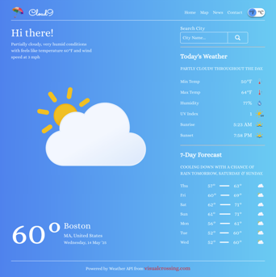
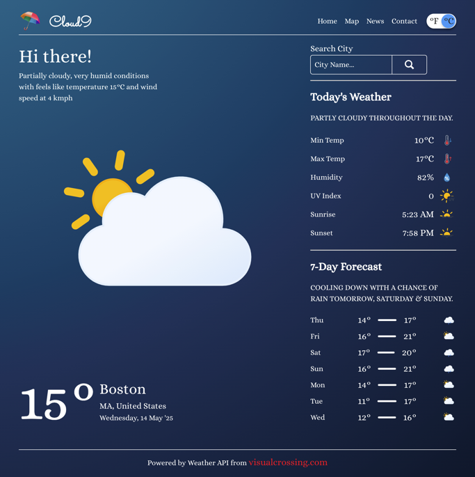

# The Odin Project - Weather App Solution

This is a solution for the [Weather App project on The Odin Project](https://www.theodinproject.com/lessons/node-path-javascript-weather-app)

## Table of contents

- [The Odin Project - Weather App Solution](#the-odin-project---weather-app-solution)
  - [Table of contents](#table-of-contents)
  - [Overview](#overview)
    - [Screenshots](#screenshots)
    - [Links](#links)
  - [Credits](#credits)

## Overview

This weather app is a simple web application that allows users to check the current weather conditions for any location. The app uses the Weather API by Visual Crossing to fetch weather data and display it on the app. Users can search for any location and the app will display the current weather conditions for that location. The app also provides a 7-day forecast for the location.

### Screenshots

|  |  |
|:-----------------------------------------------: | :--------------------------------------------------:|
|                <em>Daytime</em>                  |                <em>Nighttime</em> | 

### Links

- Solution URL: [https://github.com/py-code314/weather-app](https://github.com/py-code314/weather-app)
- Live Site URL: [https://py-code314.github.io/weather-app/](https://py-code314.github.io/weather-app/)

## Credits

- All animated weather icons are from [meteocons.com](https://github.com/basmilius/weather-icons), thanks to [Bas Milius](https://github.com/basmilius)
- Spinner icon is from [loading.io](https://loading.io/spinner/blocks/-rectangle-square-rotate-cycle-adobe)
- Gradient background images for daytime and nighttime are from [cssgradient.io](https://cssgradient.io/)
- Default background image 'Hand drawn adventure background' from [freepik.com](https://www.freepik.com/free-vector/hand-drawn-adventure-background_16665121.htm#fromView=search&page=1&position=14&uuid=30f0a776-df6b-440e-b0c4-13690c8bc096&query=Nature+Illustration)

